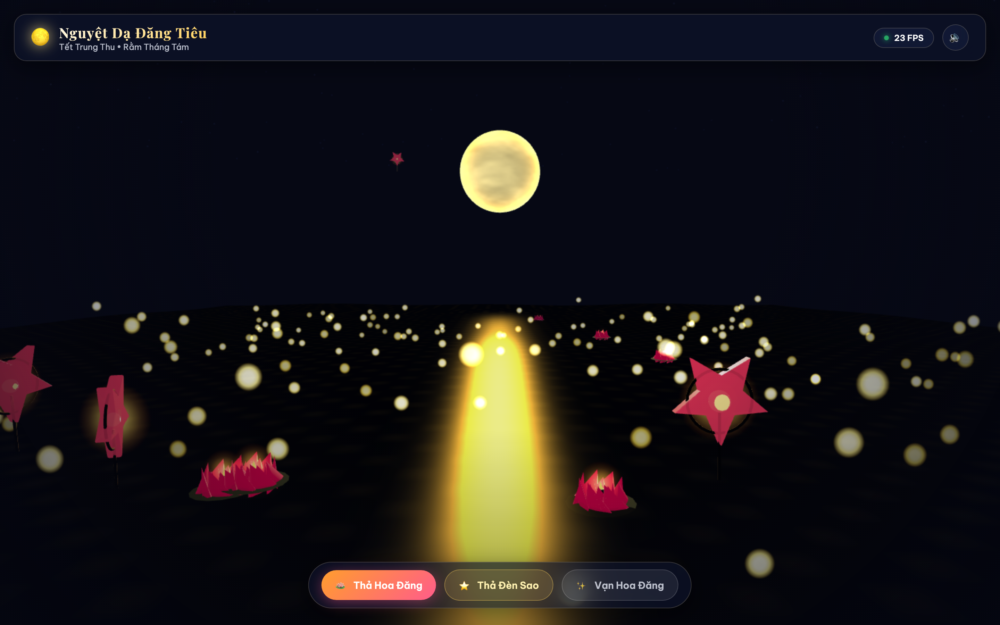
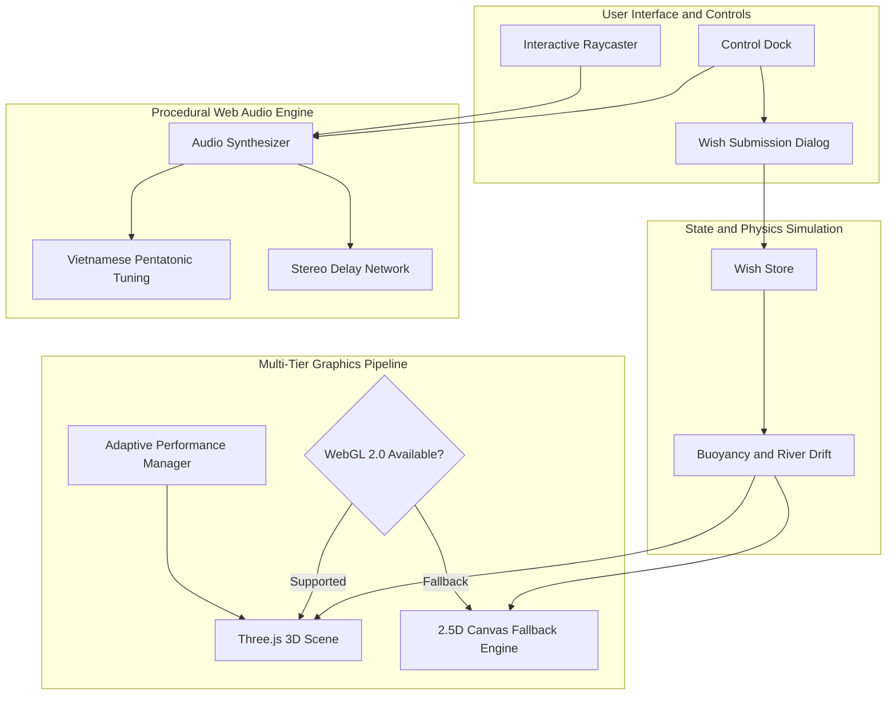

# 🌕 Nguyệt Dạ Đăng Tiêu — The Moonlit Lantern Sanctuary

> **An interactive 3D WebGL and procedural Web Audio experience commemorating the Vietnamese Mid-Autumn Festival (Tết Trung Thu).**  
> A synthesis of cultural heritage, real-time computer graphics, mathematical sound synthesis, and agentic engineering.

[](https://github.com/uit-25730067-chithanh/nguyet-da-dang-tieu/actions/workflows/ci-deploy.yml)
[](https://github.com/uit-25730067-chithanh/nguyet-da-dang-tieu)
[](https://opensource.org/licenses/MIT)
[](https://www.typescriptlang.org/)
[](https://threejs.org/)
[](https://developer.mozilla.org/en-US/docs/Web/API/Web_Audio_API)


*Fireflies dancing alongside lotus lanterns and glowing star lanterns, illuminated by candle halos and the shimmering reflection of the autumn full moon.*

**Live Interactive Experience:** [https://uit-25730067-chithanh.github.io/nguyet-da-dang-tieu/](https://uit-25730067-chithanh.github.io/nguyet-da-dang-tieu/)

---

## The Origin: An Experiment in Agentic Engineering

> *"Conceived on the evening of the Mid-Autumn Festival from a single prompt, driven by spontaneous curiosity."*

This project was built to explore a straightforward question: **What can a modern autonomous AI agent accomplish in a single uninterrupted session when granted end-to-end creative and technical freedom?**

Starting with an initial creative prompt on Mid-Autumn night, the author adopted an approval-driven posture—reviewing and accepting architectural choices, module plans, and design proposals drafted by the agent. Across this session, the system autonomously:
1. Researched and conceptualized three distinct creative directions, landing on a 3D lantern-floating sanctuary.
2. Formulated a modular implementation plan covering graphics, physics, procedural audio, state management, and accessibility.
3. Implemented custom GLSL shaders (lunar noise and water specular flow), 3D procedural geometries, a real-time raycaster, and a fallback 2.5D rendering engine.
4. Synthesized a zero-asset Web Audio engine tuned to traditional Vietnamese pentatonic scales (*Hò, Xự, Xang, Xê, Cống*).
5. Launched a real headless browser instance to visually audit UI contrast, render states, responsive viewports, and interactive clicks before committing.

There is no formal academic thesis, coursework syllabus, or commercial product agenda behind this repository. It stands as an authentic, single-evening showcase of autonomous software craftsmanship and human-agent pair programming.

---

## Key Features

- **The River of Wishes (Hoa Đăng Bồng Bềnh):** Watch multi-layered lotus lanterns (*Hoa Đăng*) and traditional red star lanterns (*Đèn Ông Sao*) drift smoothly down a tranquil river with harmonic sinusoidal bobbing and gentle angular oscillation.
- **Interactive Raycasting & Community Wishes:** Hover or click on any floating lantern to reveal heartfelt wishes, blessings, and poems left by fellow night-watchers.
- **Release Your Own Lantern:** Compose personal wishes with customizable author signatures and send your lantern onto the river, persisting locally via Web Storage.
- **Vạn Hoa Đăng (Lantern Swarm):** Release an orchestrated flurry of lanterns and watch glowing candles illuminate the water in harmonious sequence.
- **Zero-Asset Procedural Web Audio:** Generates tranquil bamboo flute tones, zither (*Đàn Tranh*) string plucks, and ambient delay feedback entirely in real-time through the Web Audio API—no external MP3/WAV audio assets or network downloads required.
- **Resilient Dual-Engine Architecture:** Features an automatic fallback to a 2.5D HTML5 Canvas rendering loop if WebGL context is lost, unsupported, or throttled.
- **Accessibility & Performance First:** Full keyboard navigation (`Space`, `1`, `2`, `3`, `M`, `Escape`), `prefers-reduced-motion` compliance, and adaptive FPS-based performance tiering.

---

## System Architecture



---

## Technical Deep Dive

### 1. Custom GLSL Shaders

- **Atmospheric Moon Shader (`moon.vert.ts` / `moon.frag.ts`):**  
  Generates lunar surface craters and dark volcanic plains (*maria*) in real time using Fractional Brownian Motion (FBM) value noise, augmented with a custom Fresnel rim-lighting equation (`pow(1.0 - dot(normal, viewDir), 2.0)`) that renders a warm golden atmospheric halo around the moon.
- **Specular River Water Shader (`water.vert.ts` / `water.frag.ts`):**  
  Simulates a dynamic nocturnal river surface. Combines sinusoidal wave displacements with a directional specular reflection trail calculated from the moon’s coordinate vector (`pow(specAngle, 64.0)`). Fresnel reflection intensifies naturally toward the horizon.

### 2. Zero-Asset Procedural Web Audio Engine

- **Pure Mathematical Sound:** All audio is calculated mathematically on the fly via `AudioContext` oscillators, gain envelopes, and biquad filters—guaranteeing instant startup and zero external asset dependencies.
- **Vietnamese Pentatonic Scale (*Thang Âm Ngũ Cung*):** Features 15 tuned frequencies across three octaves:
  - **Hò (C):** 130.81 Hz / 261.63 Hz / 523.25 Hz
  - **Xự (D):** 146.83 Hz / 293.66 Hz / 587.33 Hz
  - **Xang (F):** 174.61 Hz / 349.23 Hz / 698.46 Hz
  - **Xê (G):** 196.00 Hz / 392.00 Hz / 783.99 Hz
  - **Cống (A):** 220.00 Hz / 440.00 Hz / 880.00 Hz
- **Instrument Synthesis:**
  - *Đàn Tranh (Plucked Zither):* Dual sine and triangle oscillators with a 6ms linear attack and a 2.8s exponential decay curve.
  - *Sáo Trúc (Bamboo Flute):* Triangle wave filtered through a lowpass `BiquadFilterNode` at 1100 Hz with high resonance (Q = 2.0).
  - *Ambient Reverb Bus:* Stereo delay feedback network providing spacious nocturnal reverberation.

### 3. Dual-Engine Fault Tolerance & Accessibility

- **Zero White-Screen Guarantee:** If the client GPU crashes or triggers `webglcontextlost`, the engine intercepts the event and activates an independent 2.5D Canvas renderer with procedural particle gradients and depth-sorted drawing routines.
- **Motion Sensitivity (`prefers-reduced-motion`):** Automatically detects user operating system preferences to scale drift velocity by 75%, maintaining visual serenity without disorienting motion.

---

## Controls and Keyboard Shortcuts

| Shortcut | Action |
| :---: | :--- |
| **`Space`** or **`1`** | Open dialog to release a Lotus Lantern (*Hoa Đăng*) |
| **`2`** | Open dialog to release a Star Lantern (*Đèn Ông Sao*) |
| **`3`** | Trigger an automated swarm of festive lanterns (*Vạn Hoa Đăng*) |
| **`M`** | Toggle procedural ambient music and sound effects (Mute / Unmute) |
| **`Escape`** | Close open modals or popover wish cards |

---

## Getting Started

### Prerequisites

- **Node.js** 18.0 or later
- **npm** 9.0 or later

### Installation & Local Development

```bash
# 1. Clone the repository
git clone https://github.com/uit-25730067-chithanh/nguyet-da-dang-tieu.git
cd nguyet-da-dang-tieu

# 2. Install dependencies
npm install

# 3. Start local development server
npm run dev

# 4. Run automated test suite
npm run test

# 5. Build optimized production bundle
npm run build
```

---

## Automated Testing

The codebase maintains full test coverage with **Vitest**:

```text
 ✓ tests/physics-flow.test.ts (5 tests)
   - Initializes default lantern seed dataset correctly
   - Adds custom user wish with valid river coordinates
   - Gracefully handles empty author with anonymous fallback
   - Calculates harmonic sinusoidal bobbing within specified amplitude
   - Simulates downstream z-axis drift with speed scaling

 ✓ tests/audio-scales.test.ts (6 tests)
   - Spans 15 notes across 3 full pentatonic octaves
   - Matches traditional naming (Hò, Xự, Xang, Xê, Cống)
   - Correctly anchors A4 (Cống) at standard 440 Hz
   - Enforces strictly ascending frequencies across pitch range
   - Filters notes correctly by octave criteria
   - Accurately maps horizontal screen coordinates to pentatonic pitches

 ✓ tests/perf-manager.test.ts (3 tests)
   - Initializes default performance state at HIGH quality tier
   - Seamlessly transitions rendering configurations on setTier calls
   - Correctly flags and records WebGL context loss status

Test Files: 3 passed (3) | Tests: 14 passed (14)
```

---

## Project Structure

```
nguyet-da-dang-tieu/
├── .github/
│   └── workflows/
│       └── ci-deploy.yml        # Automated build, test, and GitHub Pages deployment
├── docs/
│   └── preview.png              # Showcase cover screenshot
├── src/
│   ├── a11y/                    # Accessibility & keyboard navigation handlers
│   ├── audio/                   # Web Audio API synthesizers & pentatonic scales
│   ├── graphics/                # Three.js scene, shaders, models, & fallback engine
│   │   ├── models/              # Procedural lotus and star lantern meshes
│   │   └── shaders/             # Custom GLSL vertex & fragment shaders
│   ├── interaction/             # Raycasting and cursor interaction logic
│   ├── physics/                 # River drift & sinusoidal buoyancy simulation
│   ├── state/                   # Wish store & Web Storage persistence
│   ├── ui/                      # Glassmorphic UI overlays & modal controllers
│   ├── main.ts                  # Core application lifecycle entrypoint
│   └── style.css                # Visual design system & modern glassmorphic styles
├── tests/                       # Unit and integration test suites (Vitest)
├── index.html                   # HTML5 application shell & SEO metadata
├── vite.config.ts               # Vite configuration & build pipeline
└── package.json                 # Project dependencies & scripts
```

---

## License

Distributed under the **MIT License**. Feel free to explore, learn from, fork, and celebrate the beauty of Vietnamese digital culture.
