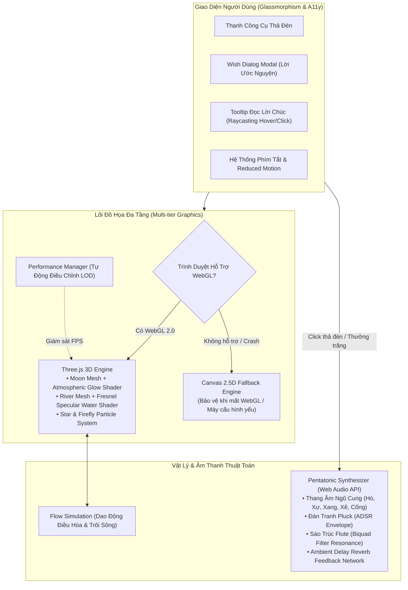

# 🌕 Nguyệt Dạ Đăng Tiêu — The Moonlit Lantern Sanctuary

> **Trải nghiệm không gian 3D WebGL & Âm nhạc ngũ cung thuật toán (Procedural Web Audio) kỷ niệm Tết Trung Thu Việt Nam.**  
> Một tác phẩm mã nguồn mở kết hợp mỹ thuật số truyền thống và kỹ thuật đồ họa web hiện đại.

[](https://github.com/uit-25730067-chithanh/nguyet-da-dang-tieu/actions/workflows/ci-deploy.yml)
[](https://github.com/uit-25730067-chithanh/nguyet-da-dang-tieu)
[](https://opensource.org/licenses/MIT)
[](https://uit.edu.vn)
[](https://threejs.org/)

🔗 **Trải Nghiệm Trực Tiếp (Live Demo):** [https://uit-25730067-chithanh.github.io/nguyet-da-dang-tieu/](https://uit-25730067-chithanh.github.io/nguyet-da-dang-tieu/)

---

## 🎑 Giới Thiệu (About The Project)

Tết Trung Thu (Rằm tháng Tám) là ngày hội đoàn viên thiêng liêng trong văn hóa Việt Nam. Dưới ánh trăng rằm tròn vành vạnh, người dân thường quây quần bên mâm cỗ, ngắm trăng, rước đèn ông sao và thả những chiếc hoa đăng mang theo lời nguyện ước bình an, may mắn trôi theo dòng sông nước biếc.

**"Nguyệt Dạ Đăng Tiêu"** tái hiện không gian đêm hội thanh bình ấy ngay trên trình duyệt web:
- **Ngắm trăng rằm tháng Tám:** Vầng trăng tỏa sáng rực rỡ với vầng hào quang khí quyển và mặt sông phản chiếu lấp lánh ánh vàng.
- **Thắp nến & Thả hoa đăng:** Người dùng tự tay đính kèm lời ước nguyện vào chiếc đèn sen nở hoặc đèn ông sao truyền thống để thả trôi bồng bềnh trên sông hoặc bay vút lên cung trăng.
- **Đọc tâm tình dưới trăng:** Nhấp vào bất kỳ chiếc đèn nào đang trôi dạt để lắng nghe những lời chúc ấm áp của mọi người từ khắp muôn phương.
- **Âm nhạc ngũ cung thuật toán:** Giai điệu sáo trúc, đàn tranh và tiếng chuông gió thanh mảnh được sinh hoàn toàn bằng toán học âm thanh thời gian thực (Zero audio assets, không lo bản quyền hay giật lag tải file).

---

## 🏛️ Sơ Đồ Kiến Trúc Hệ Thống (System Architecture)



---

## 💡 Điểm Sáng Kỹ Thuật (Technical Deep Dive)

### 1. Custom GLSL Shaders (Ánh Trăng & Mặt Sông)
- **Mặt Trăng Khí Quyển (`moon.frag.ts`):** 
  - Ứng dụng thuật toán **Fractional Brownian Motion (FBM) Value Noise** để tạo các vùng biển tối (Lunar Maria) và miệng hố va chạm tự nhiên trên bề mặt trăng.
  - Sử dụng hiệu ứng **Fresnel Rim Lighting** (`pow(1.0 - dot(normal, viewDir), 2.0)`) tạo vầng hào quang tán xạ ánh sáng vàng dịu (`#ffd15c`) đặc trưng của đêm rằm thu.
- **Mặt Sông Phản Chiếu (`water.frag.ts`):**
  - Mô phỏng dải sáng phản xạ lấp lánh (specular reflection trail) nối dài từ vầng trăng trên trời xuống lòng sông bằng phương trình vector phản xạ ánh sáng (`pow(specAngle, 64.0)`).
  - Tích hợp hiện tượng phản xạ toàn phần Fresnel: Càng nhìn xa về phía chân trời, mặt nước càng phản chiếu ánh trăng rực rỡ.

### 2. Bộ Tổng Hợp Âm Thanh Ngũ Cung Procedural (Web Audio Synth)
- **Không sử dụng bất kỳ file MP3/WAV ngoại vi nào:** Toàn bộ âm thanh được tổng hợp thời gian thực thông qua các bộ dao động sóng (`OscillatorNode`).
- **Thang Âm Ngũ Cung Việt Nam:** 15 nốt nhạc chuẩn tần số trải dài từ Quãng 3 (âm trầm đệm), Quãng 4 (sáo trúc/đàn tranh) tới Quãng 5 (chuông nốt gảy):
  - Hò (C: 261.6 Hz), Xự (D: 293.7 Hz), Xang (F: 349.2 Hz), Xê (G: 392.0 Hz), Cống (A: 440.0 Hz).
- **Bộ điều biến ADSR & Không gian vang Reverb:**
  - Tiếng đàn tranh: Attack cực nhanh (6ms), Decay theo hàm số mũ (`exponentialRampToValueAtTime`) kéo dài 2.8s.
  - Tiếng sáo trúc: Dạng sóng Triangle chạy qua `BiquadFilterNode` lọc tần số ~1100Hz với hệ số phẩm chất Q = 2.0.
  - Mạng lọc Delay Feedback tạo độ ngân vang tĩnh mịch, an nhiên của đêm thanh bình.

### 3. Cơ Chế Phòng Thủ Kép (Canvas 2.5D Fallback & Accessibility)
- **Tự Phục Hồi Khi Lỗi:** Nếu GPU yếu hoặc bị crash WebGL (`webglcontextlost`), hệ thống tự động bắt sự kiện và kích hoạt bộ vẽ **Canvas 2.5D Fallback** độc lập, đảm bảo trang web không bao giờ bị trắng màn hình.
- **Trợ Năng (A11y):** Tôn trọng thiết lập hệ thống `prefers-reduced-motion` (giảm 75% tốc độ trôi) và hỗ trợ điều khiển 100% bằng bàn phím.

---

## ⌨️ Bảng Phím Tắt Điều Khiển (Keyboard Shortcuts)

| Phím Tắt | Chức Năng |
| :---: | :--- |
| **`Space`** hoặc **`1`** | Mở hộp thoại Thả Hoa Đăng đài sen |
| **`2`** | Mở hộp thoại Thả Đèn Ông Sao lên trời |
| **`3`** | Tự động thả muôn ánh hoa đăng (Vạn Hoa Đăng) |
| **`M`** | Bật / Tắt âm nhạc ngũ cung (Mute / Unmute) |
| **`Escape`** | Đóng cửa sổ điều ước hoặc popover |

---

## 🚀 Hướng Dẫn Cài Đặt & Chạy Local (Quick Start)

Yêu cầu môi trường: **Node.js 18+** và **npm**.

```bash
# 1. Clone repository về máy
git clone https://github.com/uit-25730067-chithanh/nguyet-da-dang-tieu.git
cd nguyet-da-dang-tieu

# 2. Cài đặt các thư viện phụ thuộc
npm install

# 3. Khởi động môi trường phát triển cục bộ
npm run dev

# 4. Chạy kiểm thử tự động với Vitest
npm test

# 5. Đóng gói sản phẩm (Production Build)
npm run build
```

---

## 🧪 Kết Quả Kiểm Thử (Automated Test Suite)

Dự án được bảo vệ nghiêm ngặt bằng bộ kiểm thử tự động **Vitest**:
```text
✓ tests/physics-flow.test.ts (5 tests)
  - Khởi tạo đúng số lượng đèn mặc định
  - Thêm đèn mới kèm điều ước và tọa độ hợp lệ
  - Gán tên Ẩn danh khi để trống tác giả
  - Tính toán dao động điều hòa hình sin chuẩn biên độ
  - Đèn hoa đăng trôi xuôi dòng giảm tọa độ Z

✓ tests/audio-scales.test.ts (6 tests)
  - Đủ 15 nốt trải đều qua 3 quãng tám ngũ cung
  - Đầy đủ tên gọi truyền thống (Hò, Xự, Xang, Xê, Cống)
  - Nốt A4 (Cống) chuẩn tần số 440 Hz
  - Tần số tăng dần theo độ cao âm vực
  - Lọc đúng quãng tám chỉ định
  - Ánh xạ mượt mà từ tọa độ mặt sông sang cao độ

✓ tests/perf-manager.test.ts (3 tests)
  - Khởi tạo ở cấu hình HIGH
  - Chuyển đổi trạng thái khi setTier
  - Ghi nhận trạng thái WebGL context lost chính xác

Test Files: 3 passed (3) | Tests: 14 passed (14)
```

---

## 👨‍💻 Tác Giả & Bản Quyền (Author & License)

- **Tác giả:** Đặng Chí Thanh (Chi Thanh)
- **MSSV:** `25730067`
- **Đơn vị:** Trường Đại học Công nghệ Thông tin — ĐHQG-HCM (VNUHCM - UIT)
- **Tài khoản GitHub:** [@uit-25730067-chithanh](https://github.com/uit-25730067-chithanh)
- **Bản quyền:** Phát hành theo giấy phép [MIT License](LICENSE). Tự do sử dụng, học tập và lan tỏa nét đẹp văn hóa Việt Nam! 🌕🥮
